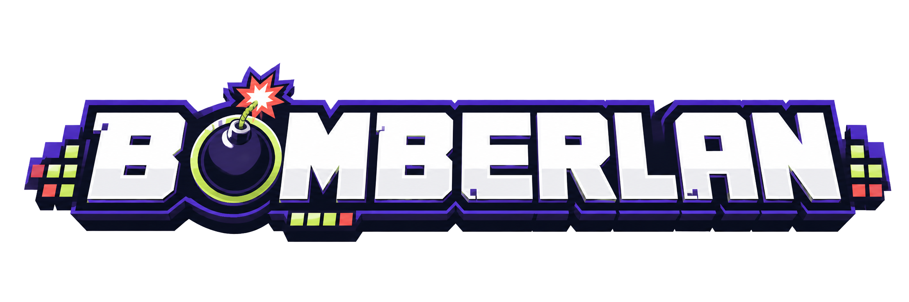

<<<<<<< HEAD
<<<<<<< HEAD
# Blast Room

A server-authoritative, real-time Bomberman-style game for up to four people. Create a room, share its link, and start a match; empty or disconnected seats are controlled by bots.

## Run locally

Requires Node.js 22+ and pnpm.

```sh
pnpm install
pnpm dev
```

Open `http://localhost:3000`. The same command runs the Vite client and the Node/WebSocket server.

## Verify

```sh
pnpm test
pnpm build
```

The project includes a multi-stage Dockerfile and a Render Blueprint. Set `PUBLIC_ORIGIN` to the final HTTPS origin so social share cards use an absolute image URL.
=======
# bomberman-challenge
>>>>>>> d6510d62696bd83918db44147dc993f893971729
=======
<p align="center">
  
</p>

<p align="center">
  <strong>Um jogo multiplayer inspirado nos clássicos de arena com bombas, visual pixelado e partidas rápidas para até quatro jogadores.</strong>
</p>

---

## 🎮 Sobre o Projeto

O **Bomberlan** é um protótipo de jogo online em tempo real. Crie uma sala, compartilhe o código com seus amigos e dispute para ser o último sobrevivente. 

As vagas livres são preenchidas automaticamente por **bots inteligentes** capazes de navegar pelo mapa, destruir caixas, fugir de explosões e enfrentar outros jogadores. 

### ⚙️ Arquitetura de Rede
* **Servidor Autoritativo:** O servidor controla a partida por completo e valida movimentos, colisões, bombas e explosões para evitar trapaças.
* **Previsão no Cliente (Client-side Prediction):** O cliente usa previsão visual limitada para manter o personagem responsivo e sem atrasos, sem perder a sincronização online.

---

## ✨ Principais Recursos

- 🌐 **Salas Online:** Criação de partidas privadas com código compartilhável.
- 🤖 **Bots Avançados:** IA com planejamento de rotas, previsão de explosões e fuga segura.
- 🎲 **Mapas Randômicos:** Arena e distribuição de caixas geradas aleatoriamente a cada rodada.
- 🧱 **Mecânicas Clássicas:** Movimento pixel-perfeito de casa em casa (estilo 16 bits) e reação em cadeia de bombas.
- 🎨 **Pixel Art:** Personagens, arenas, menus, contagem regressiva e telas de vitória totalmente animados.
- 📱 **Controles Híbridos:** Suporte completo para teclado e dispositivos com tela sensível ao toque.
- 🔌 **Tempo Real:** Comunicação via WebSocket usando arquitetura autoritativa.

---

## 🕹️ Controles

| Ação | Teclado | Telas Touch |
| :--- | :--- | :--- |
| **Movimentar** | `WASD` ou Setas Direcionais | Direcional na Tela |
| **Colocar Bomba** | `Espaço` | Botão Virtual |

> **Objetivo:** Sobreviver às explosões, eliminar seus oponentes e ser o último jogador vivo na arena!

---

## 🛠️ Tecnologias Utilizadas

- **Linguagem:** JavaScript moderno com módulos ES.
- **Backend:** Node.js, Express e biblioteca `ws` (WebSockets).
- **Frontend:** HTML5 Canvas 2D para renderização de alta performance.
- **Ferramental:** Vite para desenvolvimento ágil e build de produção.
- **Testes:** Módulo nativo `node:test` (sem dependências externas de teste).

---

## 🚀 Como Executar Localmente

### Pré-requisitos
* Node.js `22` ou superior.
* pnpm `11` ou superior.

### 1. Clonar e Instalar
```bash
# Clone o repositório
git clone https://github.com

# Acesse a pasta do projeto
cd bomberman-challenge

# Instale as dependências
pnpm install
```

### 2. Iniciar em Modo de Desenvolvimento
```bash
pnpm dev
```
Após iniciar, abra **[http://localhost:3000](http://localhost:3000)** no seu navegador.

---

## 🐳 Executando com Docker

Se preferir rodar o projeto em um ambiente isolado via Docker, utilize os comandos abaixo:

```bash
# Construir a imagem do container
docker build -t bomberlan .

# Executar o container
docker run --rm -p 3000:3000 -e PUBLIC_ORIGIN=http://localhost:3000 bomberlan
```

---

## 🧪 Testes e Build de Produção

### Rodar Testes Automatizados
```bash
pnpm test
```

### Gerar e Executar o Build de Produção
```bash
# Compilar o frontend e preparar os arquivos
pnpm build

# Iniciar o servidor de produção
pnpm start
```

> 💡 O projeto já inclui um arquivo `render.yaml` pronto para implantação automática na plataforma **Render**.

---

## 📂 Estrutura do Projeto

```text
├── client/          # Interface, controles, Canvas e animações visuais
├── public/          # Assets estáticos (logos, avatares e sprites)
├── server/          # Servidor HTTP, WebSocket e gerenciamento de salas
├── shared/          # Regras de negócio, constantes e a IA dos bots
└── test/            # Suíte de testes (salas, física, bombas e IA)
```

---

## 📈 Estado Atual e Contribuições

Este projeto é um **protótipo jogável em desenvolvimento ativo**. Sugestões, relatórios de bugs, testes de estresse e contribuições via Pull Requests são extremamente bem-vindos!

---

## 📄 Licença

Consulte o arquivo [LICENSE](LICENSE) para conhecer os termos de uso e direitos autorais do projeto.
>>>>>>> e1d4b9e6430ba42826193cf0423b78a20eded43a
