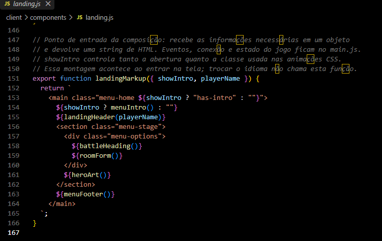
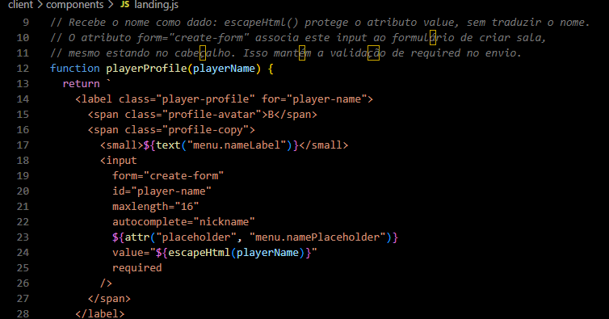
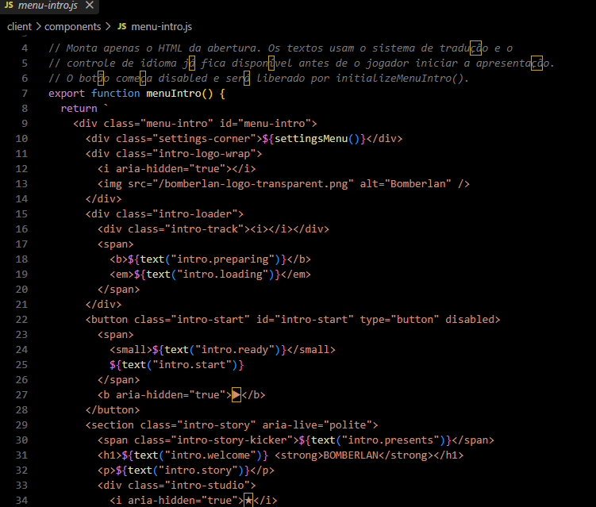
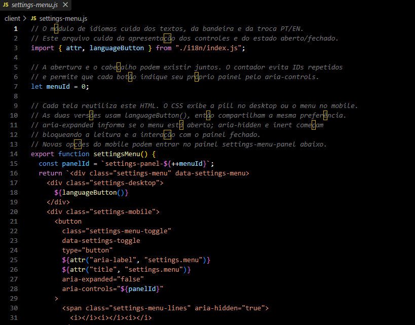

# ST-16 — Alternância de idioma Português/Inglês (i18n)

A escolha de idioma aparece como uma pill no desktop e como uma opção dentro do menu de três traços no mobile. Os textos mudam na hora, e a preferência fica salva no navegador. O nome do jogador e o código da sala continuam iguais.

Além do controle responsivo, a página inicial foi dividida em partes menores. Assim, quem for ler ou alterar o código consegue encontrar o cabeçalho, o formulário e a abertura sem procurar dentro de um bloco grande de HTML. Os comentários em português explicam como essas partes se conectam.

Os prints abaixo mostram os trechos de código apresentados na revisão.

## Página inicial dividida em componentes

`landingMarkup()` reúne as partes da tela. O HTML fica nos componentes, enquanto os eventos e a conexão com a sala continuam no `main.js`.

## Perfil do jogador organizado

`playerProfile()` concentra o campo de nome. O HTML está indentado, e os comentários explicam a ligação com o formulário e o tratamento do nome antes de inseri-lo no HTML. Esse dado não passa pelo dicionário de tradução.

## Abertura em um arquivo próprio

`menu-intro.js` reúne a apresentação inicial. `menuIntro()` monta o HTML, e `initializeMenuIntro()` controla os eventos e os tempos da animação. Isso permite entender cada responsabilidade separadamente.

## Controle de idioma no desktop e no mobile

`settingsMenu()` monta as duas apresentações do controle. O CSS mostra a pill acima de 680px e o menu compacto em telas de até 680px. Ambas usam o mesmo botão de idioma e a mesma preferência salva.

## Validação

- 55 testes automatizados aprovados e build de produção concluído na validação local.
- Troca PT/EN conferida no navegador em desktop e mobile.
- Nome e código digitados preservados durante a troca.
- Idioma mantido ao navegar novamente para a página inicial.
- Fechamento do menu por Esc, retorno do foco e criação de sala conferidos.

Veja também o [guia do sistema de idiomas](../../../client/i18n/README.md) e o [README do projeto](../../../README.md).
