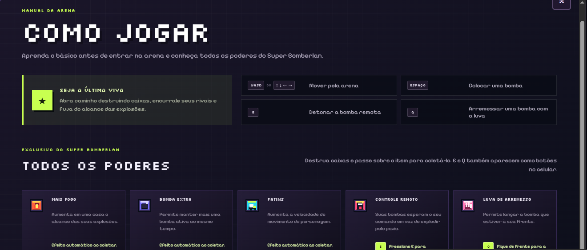
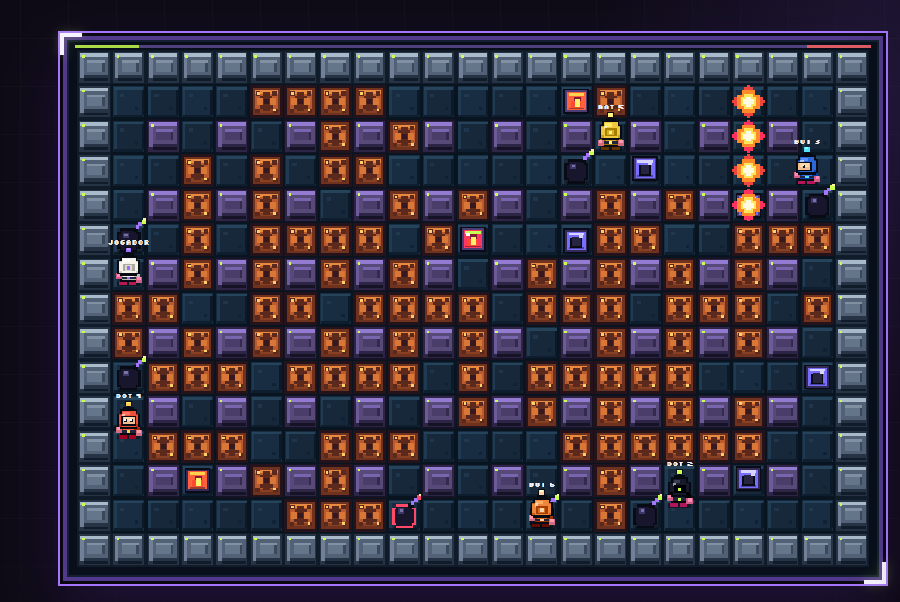

# ST-20 e ST-21 — Guia de jogo e estabilidade da movimentação

Este conjunto entrega duas melhorias relacionadas à experiência do jogador: o
guia de controles e poderes antes da partida e uma revisão do fluxo de
movimentação entre navegador e servidor.

## ST-20 — Como jogar

A tela inicial ganhou o botão **Como jogar**, logo abaixo de **Entrar com um
amigo**. Ele abre uma janela que pode ser fechada pelo botão `X`, pela tecla
`Esc` ou por um clique fora do conteúdo.

O guia apresenta o objetivo da partida, controles de teclado, controles
especiais e os dez poderes do Super Bomberlan. Cada poder possui nome, ícone,
descrição e instrução de uso.

Os dados ficam centralizados em `client/gameplay-guide.js`. O menu, a legenda
lateral e os indicadores do HUD consomem a mesma lista, evitando nomes ou
descrições diferentes entre as telas. Todo o texto usa o sistema de tradução em
português e inglês.

## ST-21 — Investigação do lag

A investigação encontrou quatro fontes principais de instabilidade:

1. A arena inteira era redesenhada em todos os frames.
2. Cliente e servidor podiam discordar temporariamente durante curvas rápidas.
3. A taxa de snapshots não era divisível pela taxa da simulação, criando uma
   cadência irregular de pacotes.
4. Compressão, serialização repetida e salas vazias aumentavam o trabalho do
   servidor em momentos de pico.

As correções incluem cache da camada estática da arena, predição com limite de
distância, reconciliação por apenas um eixo, buffer local de curvas, snapshots a
20 Hz alinhados à simulação de 40 Hz e descarte antecipado de snapshots antigos.

## Como explicar rapidamente

- **Antes da partida:** o jogador consegue aprender controles e poderes pelo
  botão Como jogar.
- **Fonte única:** menu, HUD e legenda usam os mesmos dados dos poderes.
- **Durante a partida:** o cliente responde imediatamente, mas continua limitado
  pela posição confirmada pelo servidor.
- **Quando há atraso:** pequenas diferenças são corrigidas suavemente e em um
  eixo por vez, sem movimento diagonal ou recuo brusco.
- **No servidor:** a cadência de rede ficou regular e o trabalho desnecessário
  por snapshot foi reduzido.

## Validação

- 76 testes automatizados aprovados.
- Build de produção concluído.
- Cenário com 430 ms de oscilação de rede sem congelamento ou recuo.
- Curva rápida pressionada e solta antes do centro da casa validada por WebSocket.
- Movimentação, bombas, chute e bombas arremessadas cobertos por testes.
- Layout do guia conferido em desktop e mobile.
